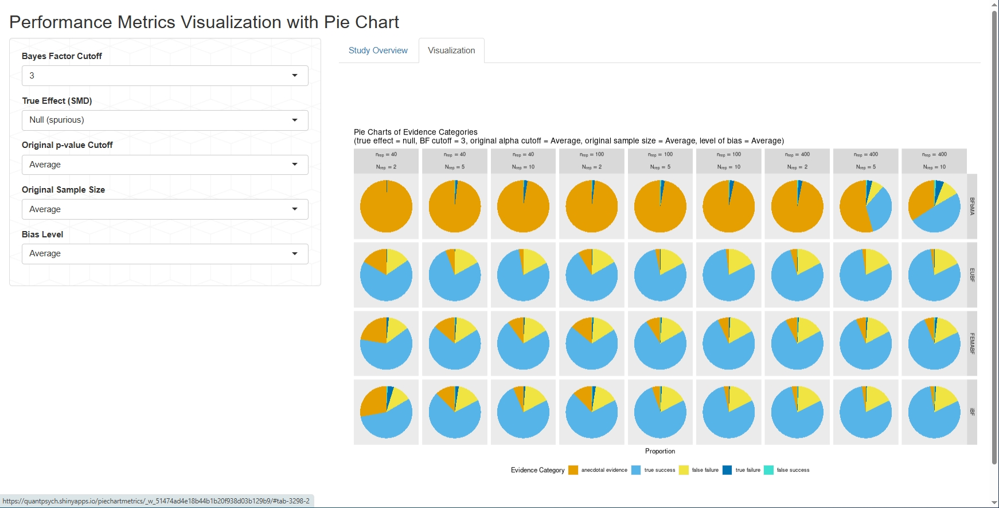
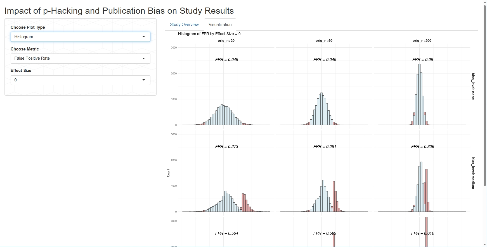
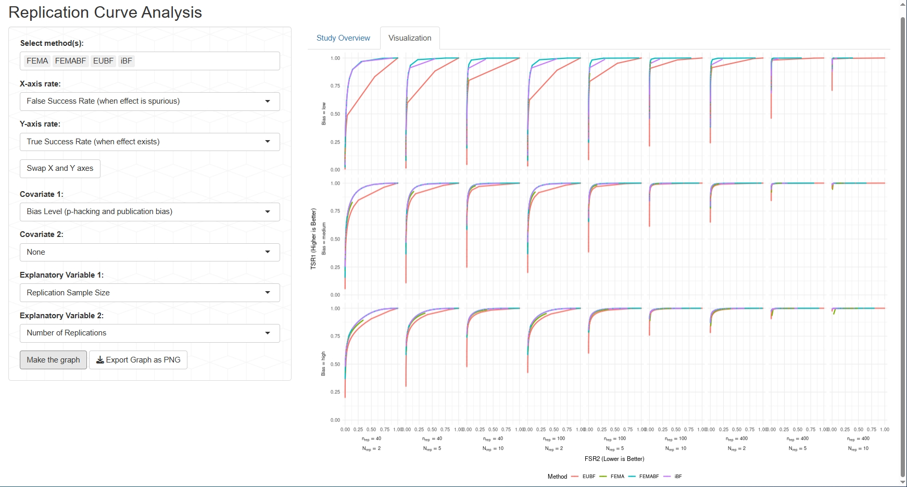
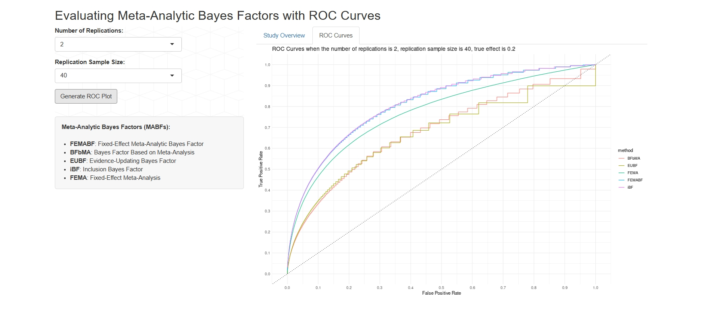
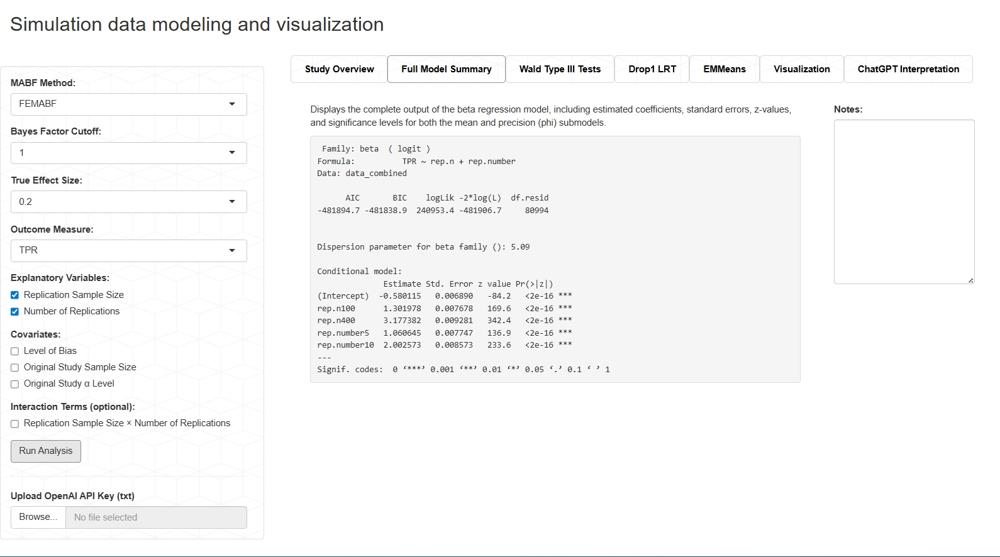

# Meta-Analytic Bayes Factor Shiny App Suite
Recent concerns about the replication crisis in psychology have underscored the need for better frameworks to assess whether original findings can be reliably replicated. This study compares the performance of several meta-analytic Bayes factors (FEMABF, BFbMA, EUBF, and iBF) both relative to one another and against the traditional fixed-effect meta-analysis in evaluating replication success.

To do so, we use a large-scale simulation to generate original studies across varied scenarios by manipulating true effect size, research environment (levels of p-hacking and publication bias), and original sample size. Replication studies are then simulated by varying replication sample size and number of replications, yielding 243 distinct scenarios and over 60 million data points.

This repository contains a collection of Shiny applications developed to visualize and model the simulation data. Each app provides a different lens on the statistical performance of MABF methods. The apps were built to support transparency, interactivity, and reproducibility in evaluating replication metrics.

---

## App Descriptions

### Shiny App 1 – Performance Metrics Pie Chart Explorer
This Shiny app visualizes how different MABF methods categorize replication outcomes using pie charts across a wide range of design conditions.

- Design filtering: Filter results by Bayes factor threshold, true effect size, original p-value cutoff, sample size, and bias level.  
- Evidence categories: View proportions of outcomes such as true success, false success, anecdotal evidence, and more.  
- Comparative panels: Compare outcome distributions across methods and replication study designs using faceted pie charts.

**Live App:** https://quantpsych.shinyapps.io/piechartmetrics/

**Screen Shot:**

---

### Shiny App 2 – p-Hacking and Publication Bias Simulation
This Shiny app explores how questionable research practices (e.g., p-hacking and publication bias) distort inferential outcomes in original studies.

- Simulated data: Examine study results across conditions with no, medium, or high research bias.  
- Visualization options: Select from histogram, heatmap, and bar plot to display TPR, FPR, TNR, and FNR.  
- Design factors: Results are organized by original sample size, true effect size, and bias level.

**Live App:** https://quantpsych.shinyapps.io/original_pvalue_visual/

**Screen Shot:**

---

### Shiny App 3 – Replication Curve Analysis Tool
This Shiny app explores how design features of replication studies and original studies impact key outcome measures of meta-analytic Bayes factor methods (e.g., True Positive Rate and False Positive Rate).

- Flexible faceting: Select explanatory variables and covariates to structure plots dynamically.  
- Rate comparisons: Visualize performance metrics such as TPR, FPR, SAR, and FCR across simulation scenarios.  
- Interactive controls: Swap axes, adjust panel layout, and download high-resolution plots of replication curves.

**Live App:** https://quantpsych.shinyapps.io/ReplicationCurve/

**Screen Shot:**

---

### Shiny App 4 – ROC Curves by Replication Design
This Shiny app visualizes ROC curves to compare the performance of different meta-analytic Bayes factor methods under varying replication designs.

- User controls: Select replication sample size and number of replications.  
- Method comparison: Display ROC curves for BFbMA, EUBF, FEMABF, iBF, and FEMA methods.  
- Performance overview: Assess method sensitivity and specificity across small and large-scale replications.

**Live App:** https://quantpsych.shinyapps.io/ROCurve/

**Screen Shot:**

---

### Shiny App 5 – Modeling and Visualization Suite
This Shiny app provides a modular dashboard for modeling, summarizing, and visualizing results from simulation-based replication studies.

- Beta regression modeling: Fit models using `glmmTMB()` with a beta distribution and logit link to handle proportions.  
- Statistical summaries: Type III Wald chi-square tests, Likelihood ratio tests, Estimated marginal means (EMMeans).  
- Dynamic visualizations: Generate plots of predicted outcome values by design variables, with optional faceting by covariates or interaction terms.  
- Optional AI support: Summarize model results in plain language using the ChatGPT API (API key upload required).

**Live App:** https://quantpsych.shinyapps.io/SimulationAnalysis/

**Screen Shot:**

